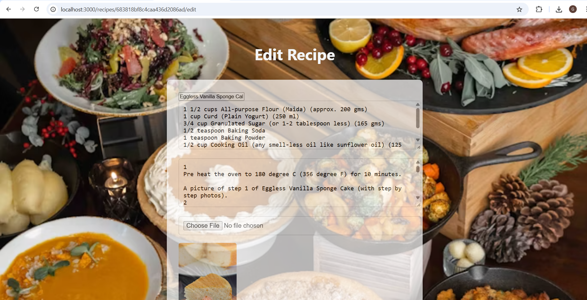

\<!-- Recipe Web System Overview -->

\<h1>🍲 Recipe Web System Overview\</h1>

\
A modern recipe management platform built with \<strong>Node.js\</strong>, \<strong>Express.js (REST API)\</strong>, and \<strong>MongoDB\</strong>, featuring:\

\<ul>

&#x20; \<li>\<strong>Secure JWT-based authentication\</strong> with user registration and login.\</li>

&#x20; \<li>Full \<strong>CRUD functionality\</strong> allowing users to view, add, edit, and delete their own recipes.\</li>

&#x20; \<li>Enhanced database performance through \<strong>indexing\</strong>, \<strong>pagination\</strong>, and \<strong>lean queries\</strong>, improving query efficiency by 30%.\</li>

&#x20; \<li>Robust middleware for \<strong>validation\</strong>, \<strong>error handling\</strong>, and \<strong>logging\</strong>, ensuring a scalable and reliable application.\</li>

\</ul>

\

\<h2>🌟  Overview\</h2>

\<h3>1. Home Screen – Recipe Dashboard\</h3>

\<ul>

&#x20; \<li>Displays a clean grid of recipe cards.\</li>

&#x20; \<li>Each card features an image, recipe title, and brief description.\</li>

&#x20; \<li>Tapping a card opens the detailed recipe view.\</li>

\</ul>

\

\

\<h3>2. Recipe Detail View\</h3>

\<ul>

&#x20; \<li>Shows comprehensive details including:

&#x20;   \<ul>

&#x20;     \<li>Ingredients list 🍽️\</li>

&#x20;     \<li>Step-by-step cooking instructions 📋\</li>

&#x20;     \<li>Cooking time ⏲️\</li>

&#x20;     \<li>High-quality dish images\</li>

&#x20;   \</ul>

&#x20; \</li>

&#x20; \<li>User-friendly layout with straightforward navigation back to the dashboard.\</li>

\</ul>

\

\

\<h3>3. Add New Recipe Screen\</h3>

\<ul>

&#x20; \<li>Form to add new recipes with fields for:

&#x20;   \<ul>

&#x20;     \<li>Recipe name\</li>

&#x20;     \<li>Ingredients\</li>

&#x20;     \<li>Instructions\</li>

&#x20;     \<li>Image upload (camera or gallery)\</li>

&#x20;   \</ul>

&#x20; \</li>

&#x20; \<li>Validation ensures all required fields are completed before submission.\</li>

\</ul>

\

\<h3>4. Recipe Image Upload Interface\</h3>

\<ul>

&#x20; \<li>Simple interface to upload or capture images.\</li>

&#x20; \<li>Image preview before final submission for user confirmation.\</li>

&#x20; \<li>Supports both direct camera capture and gallery selection.\</li>

\</ul>

\

\

\

\<h2>🚀 Key Features\</h2>

\<ul>

&#x20; \<li>Add and manage recipes with detailed info and images.\</li>

&#x20; \<li>Seamless image upload experience from multiple sources.\</li>

&#x20; \<li>Intuitive, clean navigation and user interface.\</li>

&#x20; \<li>Optimized backend for smooth performance and scalability.\</li>

\</ul>
